# Shopify Firecrawl Final Scraper

An optimized Shopify store scraper that uses Firecrawl's native link extraction and Shopify's JSON API for maximum speed and reliability. No BeautifulSoup required!

## Features

- 🚀 **Fast & Efficient**: Uses Firecrawl for rendering and native link extraction
- 📊 **Complete Product Data**: Extracts variants, pricing, subscriptions from Shopify's `.js` API
- 🔗 **Smart Crawling**: Queue-based crawling with product URL prioritization
- 🛡️ **URL Normalization**: Automatically removes tracking parameters and duplicates
- 📁 **Structured Output**: Saves both full crawl results and unique products list

## Installation

```bash
pip install firecrawl-py httpx
```

## Usage

### Basic Usage

```bash
python shopify_firecrawl_final.py "https://example-shop.com/products/sample-product"
```

### With Options

```bash
python shopify_firecrawl_final.py "https://example-shop.com" \
  --out-dir my_output \
  --max-pages 50 \
  --api-key your_firecrawl_key \
  --verbose
```

### Interactive Mode

```bash
python shopify_firecrawl_final.py
# Will prompt for URL
```

## Command-Line Arguments

| Argument | Description | Default |
|----------|-------------|---------|
| `url` | URL to scrape (optional, will prompt if not provided) | - |
| `--out-dir` | Output directory for results | `shopify_firecrawl_final_output` |
| `--max-pages` | Maximum pages to crawl | `5` |
| `--api-key` | Firecrawl API key (or use `FIRECRAWL_API_KEY` env var) | - |
| `--verbose` | Enable verbose logging | `False` |

## Output Structure

The scraper generates two JSON files:

### 1. `crawl_results.json`
Complete crawl metadata with all pages visited:
```json
{
  "crawl_time": "2025-01-20 14:30:00",
  "total_pages": 15,
  "product_pages": 8,
  "total_products": 12,
  "pages": [...]
}
```

### 2. `products.json`
Deduplicated list of unique products:
```json
{
  "total_products": 12,
  "products": [
    {
      "page_url": "https://...",
      "product_id": 123456,
      "product_name": "Product Name",
      "handle": "product-handle",
      "description": "Clean text description...",
      "available": true,
      "featured_image": "https://...",
      "variants": [
        {
          "id": 789,
          "title": "Default",
          "weight": 500.0,
          "available": true,
          "buy_once_price": "29.99",
          "compare_at_price": "39.99",
          "subscription_price": "25.49",
          "subscription_options": [...]
        }
      ]
    }
  ]
}
```

## How It Works - Flowchart

```mermaid
flowchart TD
    Start([Start]) --> ParseArgs[Parse Command Line Arguments]
    ParseArgs --> GetURL{URL Provided?}
    GetURL -->|No| PromptURL[Prompt User for URL]
    GetURL -->|Yes| InitFirecrawl[Initialize Firecrawl Client]
    PromptURL --> InitFirecrawl
    
    InitFirecrawl --> InitQueue[Initialize Queue with Start URL]
    InitQueue --> CheckQueue{Queue Empty or<br/>Max Pages Reached?}
    
    CheckQueue -->|Yes| SaveResults[Save Results to JSON]
    CheckQueue -->|No| PopURL[Pop Next URL from Queue]
    
    PopURL --> Normalize[Normalize URL<br/>Remove tracking params]
    Normalize --> CheckVisited{Already Visited?}
    CheckVisited -->|Yes| CheckQueue
    CheckVisited -->|No| MarkVisited[Mark as Visited]
    
    MarkVisited --> FirecrawlScrape[Firecrawl: Scrape Page<br/>Request HTML + Links]
    FirecrawlScrape --> DetectProduct{Is Product Page?<br/>Check URL Pattern}
    
    DetectProduct -->|No| ExtractLinks[Extract Links from<br/>Firecrawl Response]
    DetectProduct -->|Yes| FetchJSON[Fetch Shopify .js Endpoint<br/>/products/handle.js]
    
    FetchJSON --> JSONSuccess{JSON API<br/>Success?}
    JSONSuccess -->|No| LogSkip[Log: No JSON Data]
    JSONSuccess -->|Yes| ParseJSON[Parse Product JSON]
    
    ParseJSON --> ExtractVariants[Extract Variants & Pricing]
    ExtractVariants --> BuildPlans[Build Subscription Plan Lookup]
    BuildPlans --> CreateProduct[Create ProductData Object]
    CreateProduct --> StoreProduct[Store Product in Results]
    
    LogSkip --> ExtractLinks
    StoreProduct --> ExtractLinks
    
    ExtractLinks --> FilterLinks[Filter Links:<br/>- Same domain only<br/>- Skip cart/checkout/account<br/>- Normalize URLs]
    FilterLinks --> PrioritizeLinks[Prioritize Product URLs<br/>/products/, /supplements/, /shop/]
    PrioritizeLinks --> AddToQueue[Add New Links to Queue]
    AddToQueue --> CreatePageData[Create PageData Object]
    CreatePageData --> StorePageData[Store Page in Results]
    StorePageData --> CheckQueue
    
    SaveResults --> SaveCrawl[Save crawl_results.json<br/>All pages + metadata]
    SaveCrawl --> DedupeProducts[Deduplicate Products<br/>by product_id]
    DedupeProducts --> SaveProducts[Save products.json<br/>Unique products only]
    SaveProducts --> End([End])
    
    style Start fill:#90EE90
    style End fill:#FFB6C1
    style FirecrawlScrape fill:#87CEEB
    style FetchJSON fill:#87CEEB
    style SaveCrawl fill:#FFD700
    style SaveProducts fill:#FFD700
    style DetectProduct fill:#FFA07A
    style JSONSuccess fill:#FFA07A
    style CheckQueue fill:#FFA07A
```



## Architecture Overview

### Key Components

#### 1. **URL Management**
- **`normalize_url()`**: Removes tracking parameters (utm_*, fbclid, etc.) and fragments
- Ensures no duplicate pages are crawled
- Maintains clean, canonical URLs

#### 2. **Product Detection**
- **`_is_shopify_product_url()`**: Pattern matching for product URLs
  - Standard: `/products/handle`
  - Alternatives: `/supplements/handle`, `/shop/handle`
- Determines whether to extract product data

#### 3. **Data Extraction**
- **`_fetch_shopify_product_json()`**: Hits Shopify's `.js` JSON API endpoint
  - Fast, structured data
  - No HTML parsing needed
- **`_extract_product_from_json()`**: Converts JSON to structured ProductData
- **`_build_plan_lookup()`**: Maps subscription plan IDs to plan details

#### 4. **Crawling Engine**
- **`crawl_shopify_store()`**: Main crawling loop
  - Queue-based BFS (breadth-first search)
  - Uses Firecrawl for JavaScript rendering
  - Extracts links directly from Firecrawl (no BeautifulSoup!)
  - Prioritizes product pages in queue

#### 5. **Link Extraction & Filtering**
- Uses Firecrawl's native `links` field
- Filters out:
  - External domains
  - Cart, checkout, account pages
  - Already visited URLs
- Prioritizes product-like URLs

### Data Structures

```python
@dataclass
class VariantData:
    id: int
    title: str
    weight: float
    available: bool
    buy_once_price: str
    compare_at_price: Optional[str]
    subscription_price: Optional[str]
    subscription_options: List[Dict]

@dataclass
class ProductData:
    page_url: str
    product_id: int
    product_name: str
    handle: str
    description: str
    available: bool
    featured_image: str
    variants: List[VariantData]

@dataclass
class PageData:
    url: str
    is_product_page: bool
    page_title: Optional[str]
    crawled_at: str
    products: List[ProductData]
    links_found: List[str]
```

## Workflow Explanation

### Step-by-Step Process

1. **Initialization**
   - Parse command-line arguments
   - Get Firecrawl API key from args or environment
   - Initialize Firecrawl client
   - Add start URL to queue

2. **Crawling Loop** (continues until queue empty or max pages reached)
   - Pop next URL from queue
   - Normalize URL and check if already visited
   - Use Firecrawl to render the page (handles JavaScript)
   - Extract links directly from Firecrawl response

3. **Product Detection & Extraction**
   - Check if URL matches product patterns
   - If product page:
     - Fetch Shopify JSON API (`.js` endpoint)
     - Parse product data, variants, and subscription plans
     - Store product in results

4. **Link Processing**
   - Filter links (same domain, skip cart/checkout/etc.)
   - Normalize all links
   - Prioritize product URLs in queue
   - Add unvisited links to queue

5. **Results Saving**
   - Save complete crawl results with all pages
   - Deduplicate products by `product_id`
   - Save unique products to separate file

## Why This Approach?

### Advantages

1. **No BeautifulSoup Required**
   - Firecrawl handles all HTML parsing
   - Cleaner, faster code

2. **JavaScript Rendering**
   - Firecrawl renders JavaScript-heavy pages
   - Captures dynamically loaded content

3. **Structured Data Source**
   - Shopify's `.js` API provides clean, structured JSON
   - More reliable than HTML scraping

4. **Smart Crawling**
   - Product URLs prioritized
   - Tracking parameters removed
   - Duplicates automatically filtered

5. **Production-Ready**
   - Error handling throughout
   - Detailed logging
   - Structured output

## Environment Variables

```bash
export FIRECRAWL_API_KEY="your_api_key_here"
```

Or pass via command line:
```bash
python shopify_firecrawl_final.py URL --api-key your_key
```

## Error Handling

The scraper includes comprehensive error handling:
- Invalid URLs are skipped
- Failed API requests don't stop the crawl
- Malformed JSON is handled gracefully
- Firecrawl errors are logged and skipped

## Performance Considerations

- **Rate Limiting**: Firecrawl has rate limits; adjust `--max-pages` accordingly
- **Cost**: Each page costs one Firecrawl credit
- **Speed**: ~2-5 seconds per page (depending on Firecrawl response time)
- **Memory**: Minimal - results stored incrementally

## Example Output

```
============================================================
Shopify Scraper - Firecrawl Final (Optimized)
============================================================
Target: https://example-shop.com/products/sample
Max pages: 5
============================================================

[Crawling 1/5] https://example-shop.com/products/sample
[Firecrawl] Rendering page...
[Firecrawl] ✓ Page rendered
[Detection] Product page: True
[JSON API] Trying: https://example-shop.com/products/sample.js
[JSON API] ✓ Success
[Product] Sample Product
[Variants] 3 variant(s) from JSON API
[Firecrawl Links] Found 45 links
[Queue] 12 product pages, 15 other pages

...

============================================================
[Summary] Crawl Complete
============================================================
  Pages crawled: 5
  Products found: 8
============================================================

[Saved] shopify_firecrawl_final_output/crawl_results.json
[Saved] shopify_firecrawl_final_output/products.json
[Info] 8 unique products
```

## Troubleshooting

### Common Issues

**Issue**: "Firecrawl API key required"
- **Solution**: Set `FIRECRAWL_API_KEY` environment variable or use `--api-key`

**Issue**: "No JSON API data available"
- **Solution**: Some Shopify stores disable the `.js` endpoint. This is rare but can happen.

**Issue**: Crawl stops at 1 page
- **Solution**: Check if Firecrawl is finding links. Use `--verbose` to debug.

**Issue**: Duplicate products
- **Solution**: Products are automatically deduplicated by `product_id` in `products.json`

